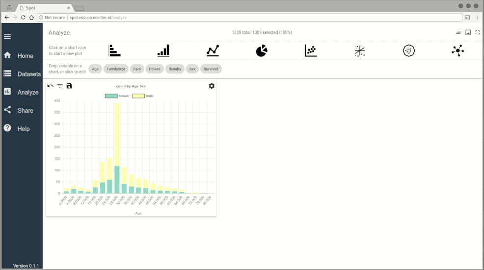

# SPOT - extensible facet browser
[](https://zenodo.org/badge/latestdoi/56071453)

[](https://www.codacy.com/app/NLeSC/spot?utm_source=github.com&amp;utm_medium=referral&amp;utm_content=NLeSC/spot&amp;utm_campaign=Badge_Grade)
<!-- [](https://www.codacy.com/app/NLeSC/spot?utm_source=github.com&amp;utm_medium=referral&amp;utm_content=NLeSC/spot&amp;utm_campaign=Badge_Coverage) -->
[](https://github.com/Flet/semistandard)

## Preview

<p align="center">
  
</p>
&nbsp;
<p align="center">
  
</p>
&nbsp;

## Quick note on privacy

<p style='color:green'>When the data is imported to SPOT, it is not saved in any cloud platforms. Your data stays only in your browser regardless what SPOT instance you are using (SPOT demo instance, SPOT-desktop).</p>


## What is SPOT?

SPOT is an open science platform on which researchers can visually analyze and compare the datasets from published scientific journal articles. It is also a visual data analytics tool for multi-dimensional datasets. SPOT allows researchers to recreate representations (plots) in the publications and do more exploration. In this way, static plots in the publications become interactive and researchers can look at the data from different angles. The interactive dashboards for the quick analysis of datasets and easy identification of correlations between variables can be done in only a few clicks. The tool was initially developed for the iDARK project, which aimed to combine and visualize the worldwide data within the most general models of dark matter. The published datasets in this research project are being collected at www.idarksurvey.com. SPOT was designed as a generic tool in order to extend and reuse it in other disciplines than physics. It is quick and responsive, even for data sets containing huge number of records.


More details about SPOT can be found at [https://research-software.nl/software/spot](https://research-software.nl/software/spot)


## How to run it

Make sure you have
[git](https://git-scm.com/book/en/v2/Getting-Started-Installing-Git) installed
on your system.

Prerequisites for running SPOT as stand-alone website using crossfilter:

1. follow the instructions to install **node.js**:
    - [via package manager](https://nodejs.org/en/download/package-manager) (suggested)
    - [Binaries](https://nodejs.org/en/download)
2. clone this repository:
    ```bash
    git clone https://github.com/NLeSC/spot.git && cd spot
    ```
3. install dependencies:
    ```bash
    npm install
    ```
    **Note:** some dependencies may require 
    [node-gyp](https://github.com/nodejs/node-gyp). If you get errors during 
    compilation of this package, you may need to install following packages on 
    Ubuntu system or equivalent packages for your distribution.
    ```bash
    sudo apt-get install -y build-essential python libpq-dev
    ```
4. Create **.env** file using **.env.sample** and adjust the settings if necassary
5. start the web the application
    ```bash
    npm start
    ```
6. open [http://localhost:9966](http://localhost:9966) in a web browser

Building the website is only tested on Linux, but it should work on any OS (Mac
OS X for example) that is supported by node and npm.

Hosting the site can be done by any webserver.

Make sure that **Javascript is enabled** in your web browser. SPOT is fully
functional in **Google Chrome** and **Chromium** web browsers and it should work
in other web browsers. Otherwise, please [submit an
issue](https://github.com/NLeSC/spot/issues).

### Using Docker (tested on Linux)

- Get the latest Docker image
```
docker pull nlesc/spot:latest
```

- Alternatively, you can build the Docker image yourself
    ```
    docker build --network=host -t nlesc/spot .
    ```

- Run SPOT in a container
```
docker run --rm --net=host -ti -p "9966:9966" nlesc/spot
```
- Open [http://localhost:9966](http://localhost:9966) in a web browser

If you want to run it using custom settings in **.env** file:
```
docker run --rm --net=host -ti -v $(pwd)/.env:/app/.env  -p "80:80" spot
```

### SQL Database

Spot can also work with a [PostgreSQL](https://www.postgresql.org) database, but
this requires either a local or a remote service to run. Communication between
the client and the database server is achieved by using [web
socket](https://github.com/socketio/socket.io).

In order to use SPOT with a PostreSQL server, you need to clone the
[spot-server](https://github.com/NLeSC/spot-server) repository and follow the
instructions in the README. In general, these are the steps to follow:

1. make sure that PostreSQL service is runnning.

2. upload your data to the database with the `spot-import.js` script

3. run the ***SPOT-server***  with the `spot-server.js` script

## Desktop version

Desktop version of SPOT is still under development. Available downloads can be
found [here](https://github.com/NLeSC/spot-desktop-app/releases).

## Documentation

SPOT API documentation can be found
[here](https://spot-api.netlify.app).

## Credits

Jisk Attema, Faruk Diblen [the Netherlands eScience Center](http://nlesc.nl)
