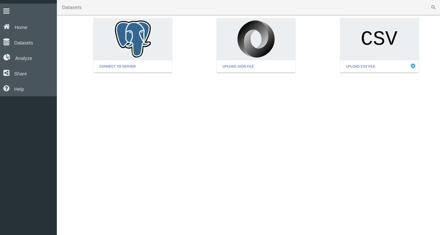

# SPOT : A Basic Tutorial with a CSV file

SPOT is an interactive visualization tool for multidimensional data that allows
quickly analysing complex datasets and easily identifying correlations between
variables. For this simple example we will use a small comma separated value file
(.csv) containing 3 facets. Each facet is stored in a column and contains the
values of a random variable. We can easily create such .csv file using Python:

```python
import numpy as np

nrows = 10000
ncols = 3

# generate draws from a normal distribution; the draws in each column
# are centered around 5.0, 10.0, and 0.0, respectively
data = np.random.normal(loc=[5.0, 10.0, 0.0], size=(nrows, ncols))

# export to a csv file
np.savetxt('simple_data.csv', data, header='x, y, z',
           delimiter=', ', comments='')
```

Note that the ``header`` argument specifies the names of the three facets. Once
the .csv file has been created, go to the SPOT directory and start the server by
running the usual commands:

```
npm run templates
npm start
```

Then open your favorite web browser and go to localhost:9966 to access the home
page of SPOT. SPOT has been tested with Chrome, Firefox and Safari but should
also work with other browsers.

---


## SPOT Homepage


On the first login, SPOT's Help tool welcomes you. You can access the Help
function at any time via the bottom of the left Menu bar. Orginally developed
for the [iDark project](https://www.esciencecenter.nl/project/idark), SPOT
maintains a space-oriented appearance. Due to its origin, SPOT focuses on
big-data exploration with the possibitly to explore and analyse the data set in
great detail and just in a few clicks.

The traditional workflow of a SPOT session consists of three main steps:
1. **Load the dataset**
   You can load a CSV or a JSON file or connect to a postgres database.

2. **Analyse the data**
   Exploit the native SPOT features to plot and explore one or multiple data sets.

3. **Share the information**
   Export your data and/or your entire SPOT session or Upload a previous SPOT session.

You can easily navigate along these three steps from the menu left bar. A
dedicated button is associated to each step and allows you going back and forth
along the workflow. A detailed description of each step of the workflow is
given in the following. From the SPOT Home page you can also:

-  ** Start the Demo Session **

  A demo file will be fetched online and automatically uploaded on the active
  SPOT session. This way, you can have a quick look at a final session in a
  simple click!

-  **Access the GitHub Page**

  Go to the SPOT Github page to clone the repository and interact with our
  developers:

-  **Access the NLeSC webpage**

  Don't forget to visit the Netherlands eScience Center webpage to browse through
  the multiple projects and find opportunities for collaboration.


___

## Step 1. Load your data





The first step of the SPOT workflow consists of uploading your data set to the
browser. To load your data into the app, click on the **Datasets** button in the
left menu bar. This takes you the main loading page of SPOT (see above). Three
options are available to load your data in SPOT.

  1. **Connect to a server** You can connect to a database where your dataset is stored

  2. **Upload a JSON file** You can upload a simple JSON file. JSON, or
  JavaScript Object Notation, is a popular file format for attribute-value pairs
  and array data types. SPOT fully support JSON files.

  3. **Upload a CSV file**. You can upload a simple CSV file. CVS, or comma
  separated values, are simple files containing different variables stored in
  column format. To facilitate the import of CSV files, several options are
  accessible by clicking on the settings icon  [](./csv_options.jpg). You can for example specify how
  the columns are delimited and if there is a specific header in the file or not.


For our purpose, we are going to upload the CSV file we have created above. To
do that, click on the CSV button and navigate to the file in the popup window.

### Edit your data

Once the data file has been loaded in SPOT, you have the possibility to
delete it, or edit its properties by clicking on its setting icon . This will open the Edit page of the data. On this page
all the facets detected by SPOT are displayed. In our case this dataset only
contains 3 facets called _x_,_y_ and _z_. These names correspond to the header of
the .csv file we have created above.


You can disable/enable individual facets by clicking on the slider button next
to its name . By clicking on the setting icon in a given
variable box, you can also edit the properties of this particular variable.


## Step 2. Analyze your data

The main feature of SPOT is its ability to easily plot and explore the data
using multiple coordinated views, cross-plot selection, and drilldown. To start
plotting your data and exploring its facets click on  **Analyze** in the left
menu bar. This takes you to the SPOT's plotting page. From this page you can
create, edit and interact with different plots.


On the top of the page you have access to different plotting functions ranging
from simple histograms to more advanced network charts. Below this are the
facets that are present in the data set. You can recognise here the three
variables _x_,_y_ and _z_ contained in our .csv file.


### Simple histogram plots

To start with the visualization we are first going to create three histograms,
representing the variables _x_, _y_ and _z_. To do so:

  1. **Click** on the Bar Chart  icon to create a
     first histogram plot.
  2. **Drag** the variable _x_ to the **Group by** entry box on the plot.


Thanks to these two easy steps we have created a histogram of the _x_ variable.
As you can see, other options are available for the barchart plot via different
entry boxes. These entry boxes are:

  * **Subdivide by** subdivide each bar in different category controlled by the
    variable dragged in the box

  * **bar height** fix the height of each bar not by the number of data points
    it aggregates but by the variable dragged in the entry box.

  * **Error bar** Plot the error bar for each bar


As we'll see in the following, each type of plot has its own set of options that
can be controlled by specific variables. For this example we will only use the
_x_ variable in the **Group by** entry box and leave all the other boxes empty.

To finalize the visualization of this plot, and **hide the entry boxes**, click
on the settings wheel icon  located on the top
right corner of the plot. Clicking on this image allows switching between an
edit mode and a view mode of the plot. The Edit and View modes have different
purposes:

  * **Edit Mode** Configure the aspect of the plot by specifying what to plot
    and how to plot it
  * **View Mode** Explore your data by selecting part of it and/or zoom in
    specific part of your dataset

You can repeat the same operations for the two remaining varialbes and have
three histograms plotted on your SPOT session. You can freely move the windows
to align them horizontally:


### Customizing plots

It is possible to customize the appearance of each plot. Return to Edit mode by
clicking on the wheel in th top right corner . Then click on the *Group by* box of one of the histogram to open the
configuration of this plot. There you can change the range of the x-axis,
specify the number of bins you want for the histogram and many more options. For
example here we specify that the x axis should range between -4 and 4 and
contains 25 bins. Click on **Analyze** in the left menu bar to return to your
plot.


### Scatter plot

SPOT also allows for more advanced plotting functions such as line plots, 2D and
3D scatter plots, network plot, etc. We are here going to create a scatter
plot of _x_ versus _y_.

  1. Click on the bubble-chart icon 
  2. Drag the x variable in the *X axis* box of the new plot
  3. Drag the y variable in the *Y axis* box of the new plot

As before, click on the setting wheel  of the plot to finalize its visualization. One important thing to
remember is that SPOT only plots binned data. Hence each symbol on the scatter
plot represent the aggregation of multiple data points. The binning of the
plot can be customized by clicking on the *X axis* box. There you can specify
the range of the x axis as well as the number of bins required along the axis.
The same thing can be done for the y-axis.


As you can see, other options are available to configure the scatter plot. You
can for example control the point color and the point size using one of the
variables. To understand the effect of these options drag the _z_ variable to the
*Point color* box of the scatter plot. Each point is now colored according to
the values of the _z_ variables. Several modes are accessible by clicking on the
*Point Color* box. Namely the color of each point can represent the average,
sum, standard deviation of the z-values, or simply the number of points it
aggregates. We can also use the values of the _z_ variables to control the size
of the points by dragging the _z_ variable in the *Point size* box of the plot.


### Dynamic Data Selection

One of the main strengths of SPOT is the possibility to slice through your data
simultaneously across different plots. This enables you to get a better
understanding of the underlying structure of your dataset and to easily discover
new relations hidden in the vast amount of information it contains.

To understand what _slicing across multiple plots_ means, select a range of
values by clicking on individual bars in the bar chart of the _x_ variable.
Repeat the same operation on the two remaining bar charts to select value ranges
for the _y_ and _z_ variable. As you can see the 2D scatter plot is
automatically adjusted to only represent the data points that were selected in
the different bar charts.


You can remove the selection by pressing the undo button 
on the top left corner of the plot.

### Dive into your data

As already mentioned earlier, the data plotted in the SPOT plots are binned.
Hence a single point or bar represents the aggregation of multiple data points.
With SPOT, it is possible to dive into your data by progressively zooming into a
specified area of the plot. For example in the 2D scatter plot you can select
the central region of the plot by clicking on different points of the plot. The
selected area appears as a yellow rectangle on the plot.


An important feature of SPOT is the possiblity to zoom in and out of your data
to obtain a more detailed or a more general representation of the data. To
navigate inside your dataset use the two buttons on the top left corner of the
plot:

  *  *Zoom In* Ony plot the part of the dataset that is
    selected and update the plot. By clicking you can dive into your data
    and progressively zoom inside your data set until each bar or point only
    represents a single data point.

  *  *Zoom out* Return to the previous level of detail
    and update all the plots. You can progressively zoom out of your data
    until the entire dataset is represented on the plot.


## Step 3. Download the session

Once you are satisfied with your SPOT session you can export the data and/or the
entire SPOT session in JSON format. You can access the export page by clicking
on *Share* in the left menu bar.

This page allows you to export the data and export the session. This session
file can also be re-uploaded through the Upload Session button to restart a
previous SPOT session and continue the data exploration.


